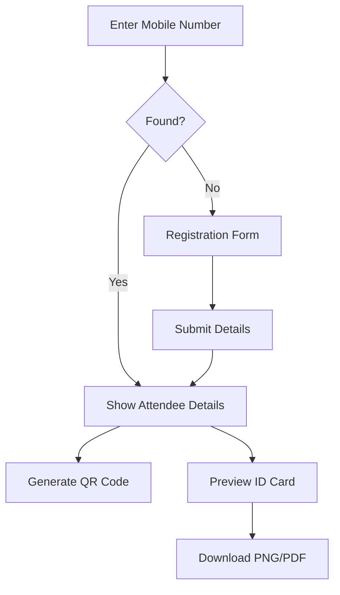

# Event Attendee Portal - QR Code & ID Card System

A modern, professional web application for event attendees to retrieve their information, generate QR codes, and download beautifully designed event ID cards.


## ✨ Features

### 🎫 For Attendees
- **Quick Lookup**: Search by mobile number for instant access
- **Auto-Registration**: Register on-the-fly if not found in system
- **QR Code Generation**: Automatic, secure QR code with attendee data
- **Professional ID Cards**: Download high-quality ID cards in PNG or PDF
- **Mobile Responsive**: Works seamlessly on all devices

### 🔧 For Developers
- **Type-Safe API**: Auto-generated TypeScript client via Orval
- **OpenAPI Integration**: Syncs automatically with backend spec
- **Modern Stack**: Next.js 16, React 19, TypeScript 5
- **Beautiful UI**: Tailwind CSS v4 with custom components
- **Production Ready**: Error handling, loading states, validation

## 🚀 Quick Start

### Prerequisites
- Node.js 20.x or higher
- Backend API running at `http://0.0.0.0:8080`
- Backend must expose OpenAPI spec at `/api-json` (or configure in `orval.config.ts`)

### Installation

```bash
# 1. Install dependencies
npm install

# 2. Generate TypeScript API client from backend
npm run generate:api

# 3. Create environment file
echo "NEXT_PUBLIC_API_BASE_URL=http://0.0.0.0:8080" > .env.local

# 4. Start development server
npm run dev
```

Open [http://localhost:3000](http://localhost:3000) in your browser.

## 📁 Project Structure

```
qrcode-client-attendees/
├── app/
│   ├── page.tsx              # Main portal page
│   ├── layout.tsx            # Root layout
│   └── globals.css           # Global styles & Tailwind
├── components/
│   ├── ui/                   # Reusable UI components
│   │   ├── button.tsx
│   │   ├── input.tsx
│   │   ├── card.tsx
│   │   └── label.tsx
│   ├── AttendeeForm.tsx      # Mobile search & registration
│   ├── AttendeeDetails.tsx   # Attendee info display
│   └── IDCard.tsx            # Professional ID card design
├── lib/
│   ├── api.ts                # Main API wrapper (USE THIS!)
│   ├── api-mutator.ts        # Axios instance & interceptors
│   ├── qr-utils.ts           # QR code & download utilities
│   └── generated/            # Auto-generated by Orval
│       ├── attendees/        # API functions
│       └── models/           # TypeScript types
├── openapi.yaml              # API specification
├── orval.config.ts           # Orval configuration
└── package.json
```

## 🎯 User Flow



1. **Search**: Attendee enters mobile number
2. **Lookup**: System checks backend API
3. **Register**: If not found, quick registration form
4. **Display**: Show all details with auto-generated QR code
5. **Download**: Preview and download ID card in multiple formats

## 🔌 API Integration

### Using the Generated Client

```typescript
import { attendeeApi, type Attendee } from '@/lib/api';

// Get attendee by mobile
const attendee = await attendeeApi.getByMobile('1234567890');

// Register new attendee
const newAttendee = await attendeeApi.register({
  mobile: '1234567890',
  name: 'John Doe',
  email: 'john@example.com',
  organization: 'Tech Corp',
  designation: 'Engineer'
});

// Update attendee
await attendeeApi.update('attendee-id', {
  name: 'Jane Doe',
  email: 'jane@example.com'
});
```

### Regenerating API Client

When your backend OpenAPI spec changes:

```bash
# If backend is running
npm run generate:api

# Watch mode for development
npm run generate:api:watch

# Or specify custom URL
OPENAPI_URL=http://localhost:8080/api-json npm run generate:api
```

### Backend Requirements

Your backend must implement these endpoints:

- `GET /attendees/mobile/:mobile` - Get attendee by mobile number
- `POST /attendees/register` - Register new attendee
- `PUT /attendees/:id` - Update attendee (optional)
- `GET /attendees/:id` - Get attendee by ID (optional)

And expose OpenAPI spec at one of:
- `/api-json` (NestJS default)
- `/openapi.json`
- `/docs-json`
- `/swagger.json`
- Or configure in `orval.config.ts`

## 🎨 ID Card Features

The ID card includes:

### Visual Elements
- ✅ Gradient background (blue to purple)
- ✅ High-resolution QR code with scan badge
- ✅ Professional layout with icons
- ✅ Color-coded information sections
- ✅ Event details and venue
- ✅ Secure attendee ID
- ✅ Logo placeholder (customizable)

### Download Options
- **PNG**: High-quality image for printing
- **PDF**: Document format for easy sharing
- **Preview**: Review before downloading

### Customization

Edit `components/IDCard.tsx` to customize:

```typescript
// Change gradient colors
className="bg-gradient-to-br from-blue-600 to-purple-700"
// Change to your colors ↓
className="bg-gradient-to-br from-green-600 to-teal-700"

// Add company logo


// Modify layout, add fields, etc.
```

## 🛠️ Development

### Available Scripts

```bash
# Development
npm run dev              # Start dev server
npm run generate:api     # Generate TypeScript client
npm run generate:api:watch  # Watch mode for API generation

# Production
npm run build           # Build for production
npm run start           # Start production server

# Code Quality
npm run lint            # Run ESLint
npx prettier --write .  # Format code
```

### Environment Variables

Create `.env.local`:

```env
# Backend API URL
NEXT_PUBLIC_API_BASE_URL=http://0.0.0.0:8080

# OpenAPI spec URL (for generation)
OPENAPI_URL=http://0.0.0.0:8080/api-json
```

### Adding New API Endpoints

1. Update your backend with new endpoint
2. Regenerate client: `npm run generate:api`
3. Import and use in components:

```typescript
import { attendeeApi } from '@/lib/api';

// All endpoints are automatically typed!
const result = await attendeeApi.newEndpoint();
```

## 📸 Screenshots

### Mobile Search
- Clean, simple form
- Real-time validation
- Loading states

### Registration Form
- All required fields validated
- Optional organization/designation
- Inline error messages

### Attendee Details
- Two-column responsive layout
- Left: Personal information
- Right: QR code with download
- Bottom: ID card download CTA

### ID Card Preview
- Modal overlay with backdrop blur
- Full ID card preview
- Download format selection (PNG/PDF)
- Close/Cancel options

## 🔐 Security Features

- Type-safe API calls prevent common errors
- Input validation on forms
- Error boundary protection
- CORS configuration support
- Secure QR code generation
- No sensitive data in URLs

## 🎯 Best Practices

### Code Organization
```typescript
// ✅ Good - Use generated types
import { type Attendee } from '@/lib/api';

// ❌ Bad - Don't manually type
interface Attendee { ... }

// ✅ Good - Use API wrapper
import { attendeeApi } from '@/lib/api';

// ❌ Bad - Don't use generated functions directly
import { getAttendees } from '@/lib/generated/attendees/attendees';
```

### Error Handling
```typescript
try {
  const attendee = await attendeeApi.getByMobile(mobile);
  // Handle success
} catch (error: any) {
  if (error.response?.status === 404) {
    // Show registration form
  } else {
    // Show error message
  }
}
```

## 🐛 Troubleshooting

### API Generation Fails
```bash
# Check if backend is running
curl http://0.0.0.0:8080/api-json

# Validate OpenAPI spec
npx @apidevtools/swagger-cli validate openapi.yaml

# Clear and regenerate
rm -rf lib/generated && npm run generate:api
```

### CORS Errors
Ensure your backend allows requests from frontend origin:
```javascript
// Backend (Express)
app.use(cors({ origin: 'http://localhost:3000' }));
```

### QR Code Not Generating
- Check browser console for errors
- Verify attendee data is complete
- Ensure `qrcode` library is installed

### ID Card Download Not Working
- Check if `html2canvas` is installed
- Verify element ID matches (`id-card-container`)
- Disable browser extensions that block canvas

## 📦 Dependencies

### Core
- `next` (16.0) - React framework
- `react` (19.2) - UI library
- `typescript` (5.x) - Type safety

### API & Data
- `axios` (1.13) - HTTP client
- `orval` (7.17) - TypeScript client generator

### UI & Design
- `tailwindcss` (4.x) - Styling
- `lucide-react` (0.561) - Icons
- `class-variance-authority` - Component variants

### QR & Downloads
- `qrcode` (1.5) - QR code generation
- `html2canvas` (1.4) - Element to image
- `jspdf` (3.0) - PDF generation

## 🚢 Deployment

### Vercel (Recommended)
```bash
# Install Vercel CLI
npm i -g vercel

# Deploy
vercel

# Set environment variables in Vercel dashboard
NEXT_PUBLIC_API_BASE_URL=https://your-api.com
```

### Other Platforms
```bash
# Build
npm run build

# Start
npm start
```

Environment variables must be set on the hosting platform.

## 📄 License

Proprietary - All rights reserved

## 👥 Support

For issues or questions:
1. Check existing documentation
2. Review backend API integration
3. Contact development team

---

Built with ❤️ using Next.js, TypeScript, and Orval
